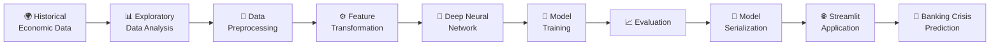
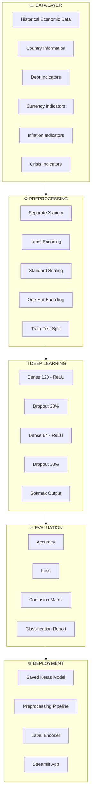
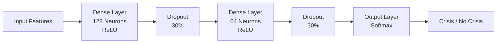
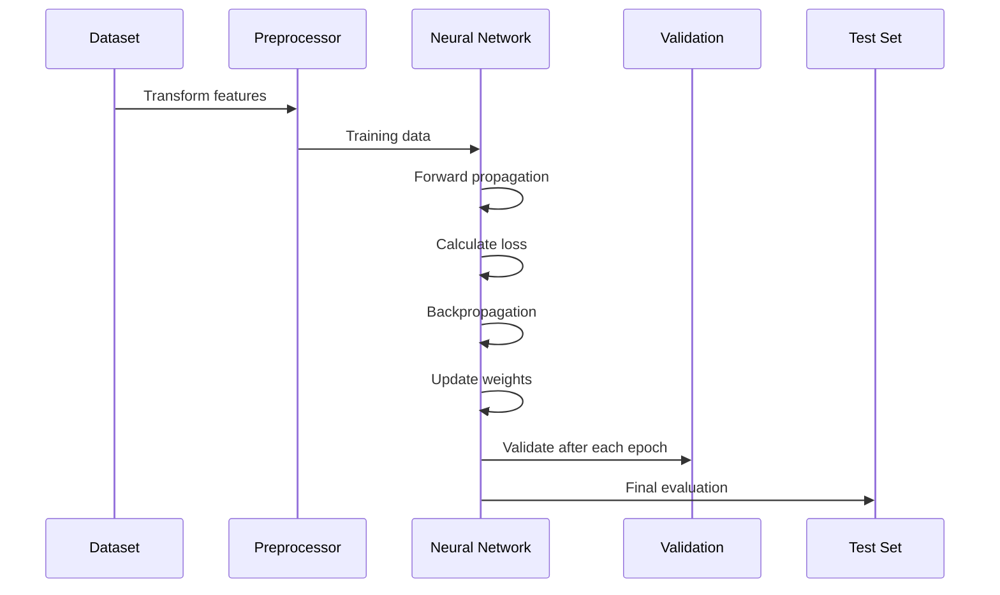
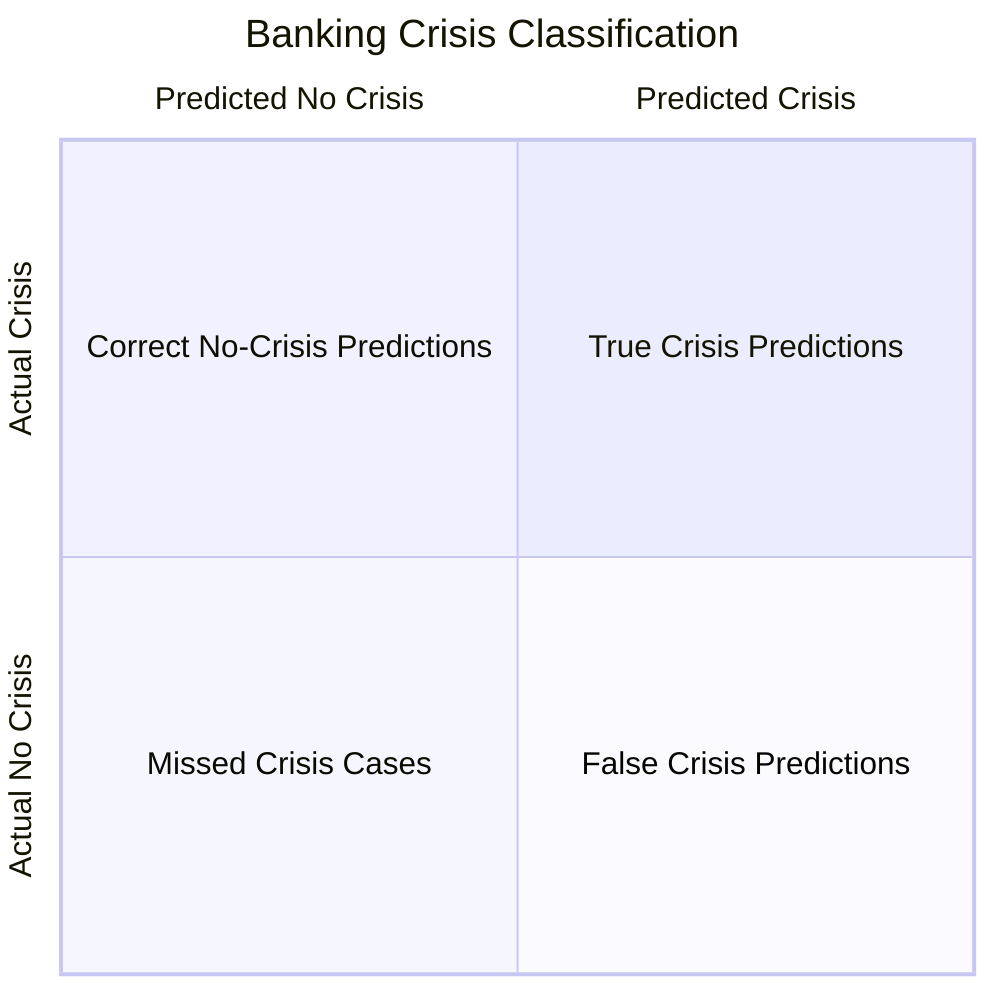
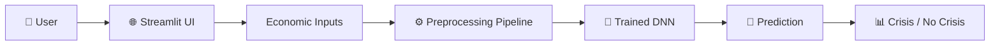

# 🌍 Africa Banking Crisis Prediction

### 🧠 Deep Learning × Economic Intelligence

<p align="center">
  
  
  
  
</p>

<p align="center">
  <b>Predicting banking-crisis conditions from historical African economic indicators using Deep Learning.</b>
</p>

<p align="center">
  <a href="#-project-overview">Overview</a> •
  <a href="#-architecture">Architecture</a> •
  <a href="#-model">Model</a> •
  <a href="#-evaluation">Evaluation</a> •
  <a href="#-deployment">Deployment</a>
</p>

---

## 🌍 From Economic Data to Crisis Intelligence

Financial crises rarely emerge from a single indicator.

They are shaped by a complex interaction of **inflation, currency instability, sovereign debt, domestic debt, systemic stress and broader economic conditions**.

This project explores whether those historical patterns can be learned by a **Deep Neural Network** and transformed into an interactive prediction system.

> **Can historical economic signals help us identify banking-crisis conditions?**

This project attempts to answer that question using a complete **Data → Deep Learning → Evaluation → Deployment** pipeline.

---

## ⚡ What This Project Does

```text
        🌍 ECONOMIC DATA
              │
              ▼
        📊 DATA ANALYSIS
              │
              ▼
      🧹 PREPROCESSING
              │
       ┌──────┴──────┐
       ▼             ▼
   Numerical      Categorical
    Scaling        Encoding
       │             │
       └──────┬──────┘
              ▼
       🧠 DEEP NEURAL
          NETWORK
              │
              ▼
       📈 MODEL TRAINING
              │
              ▼
       🎯 EVALUATION
              │
              ▼
        💾 SAVED MODEL
              │
              ▼
       🌐 STREAMLIT APP
              │
              ▼
      🔮 CRISIS PREDICTION
```

---

## 🧠 The Core Idea

The system takes historical economic and financial indicators as input and learns relationships between those indicators and the `banking_crisis` target.

### Input

```text
🏦 Banking Indicators
💰 Debt Indicators
📉 Inflation Indicators
💱 Currency Indicators
🌍 Country Information
📅 Historical Information
⚠️ Crisis Indicators
```

⬇️

### Deep Learning Model

```text
Input Features
      ↓
Dense Layer — 128 Neurons
      ↓
ReLU Activation
      ↓
Dropout — 30%
      ↓
Dense Layer — 64 Neurons
      ↓
ReLU Activation
      ↓
Dropout — 30%
      ↓
Softmax Output
```

⬇️

### Output

```text
🟢 NO CRISIS
        OR
🔴 BANKING CRISIS
```

---

## 📊 Project at a Glance

| 🔍 Component         | 🛠️ Implementation                                      |
| -------------------- | ------------------------------------------------------- |
| Problem              | Banking Crisis Classification                           |
| Learning Type        | Supervised Learning                                     |
| Model                | Deep Neural Network                                     |
| Framework            | TensorFlow / Keras                                      |
| Preprocessing        | Scikit-learn                                            |
| Numerical Features   | StandardScaler                                          |
| Categorical Features | OneHotEncoder                                           |
| Hidden Layers        | 128 → 64                                                |
| Activation           | ReLU                                                    |
| Regularization       | Dropout                                                 |
| Output               | Softmax                                                 |
| Evaluation           | Accuracy, Loss, Confusion Matrix, Classification Report |
| Deployment           | Streamlit                                               |

---

## 🏗️ End-to-End Architecture



---

## 🔬 Why Deep Learning?

Traditional statistical approaches can struggle when relationships between economic indicators become highly nonlinear.

A neural network can learn complex patterns across multiple variables simultaneously.

The architecture therefore combines:

**Dense Layers**
→ learn nonlinear relationships

**ReLU Activation**
→ introduce nonlinear learning capacity

**Dropout**
→ reduce overfitting

**Softmax Output**
→ convert the final representation into class probabilities

---

## 🎯 Project Goal

The ultimate objective isn't simply to achieve a high accuracy score.

It is to build a complete, reproducible machine-learning workflow:

> **Understand the data → transform the data → learn the patterns → evaluate the model → deploy the intelligence.**

---

### 🚀 Built as an AI & Data Science Project

**Python • Pandas • NumPy • Scikit-learn • TensorFlow • Keras • Matplotlib • Seaborn • Streamlit**

<p align="center">
  <b>🌍 Turning historical economic data into machine-learning intelligence.</b>
</p>


## 📌 Project Overview

Financial crises can emerge from a combination of economic instability, currency problems, debt defaults, inflation, and systemic financial stress.

This project develops a **Deep Neural Network (DNN)** to classify whether a historical observation corresponds to a **banking crisis** or **no banking crisis**.

The complete machine-learning pipeline covers:

* 📊 Exploratory Data Analysis
* 🧹 Data preprocessing
* 🔢 Categorical encoding
* 📏 Numerical feature scaling
* 🧠 Neural-network architecture
* 🚀 Model training
* 📈 Training/validation analysis
* 🎯 Confusion-matrix evaluation
* 📋 Classification report
* 💾 Model serialization
* 🌐 Streamlit deployment

---

# 🎯 Objective

> **Build a deep-learning classification system capable of identifying banking-crisis conditions from historical economic and financial indicators.**

The target variable used in the notebook is:

```text
banking_crisis
```

The model classifies observations into the encoded target classes:

```text
crisis
no_crisis
```

---

# 🌍 Dataset

The project uses the **Africa Economic, Banking and Systemic Crisis Dataset**.

The dataset contains historical observations involving economic, monetary, debt, currency, inflation, and crisis-related indicators across African countries.

### Important Features

| Feature                           | Description                               |
| --------------------------------- | ----------------------------------------- |
| `case`                            | Case identifier                           |
| `cc3`                             | Three-letter country code                 |
| `country`                         | Country name                              |
| `year`                            | Observation year                          |
| `systemic_crisis`                 | Systemic crisis indicator                 |
| `exch_usd`                        | Exchange-rate related indicator           |
| `domestic_debt_in_default`        | Domestic debt default indicator           |
| `sovereign_external_debt_default` | Sovereign external debt default indicator |
| `gdp_weighted_default`            | GDP-weighted default indicator            |
| `inflation_annual_cpi`            | Annual CPI inflation                      |
| `independence`                    | Independence indicator                    |
| `currency_crises`                 | Currency crisis indicator                 |
| `inflation_crises`                | Inflation crisis indicator                |
| `banking_crisis`                  | 🎯 Prediction target                      |

---

# 🧠 Machine Learning Pipeline

```mermaid
flowchart LR

    A[🌍 Economic & Banking Dataset]
    --> B[📊 Exploratory Data Analysis]

    B --> C[🧹 Data Preprocessing]

    C --> D{Feature Types}

    D -->|Numerical| E[📏 StandardScaler]
    D -->|Categorical| F[🔢 OneHotEncoder]

    E --> G[🔗 Combined Feature Matrix]
    F --> G

    G --> H[✂️ Train / Test Split]

    H --> I[🧠 Deep Neural Network]

    I --> J[🚀 Model Training]

    J --> K[📈 Validation]

    K --> L[🎯 Test Evaluation]

    L --> M[💾 Save Model]

    M --> N[🌐 Streamlit Application]

    N --> O[🔮 Banking Crisis Prediction]
```



---

# 🔬 Project Architecture



---

# ⚙️ Data Preprocessing

The preprocessing pipeline separates the target from the input features.

### 1. Target Separation

```python
y = df['banking_crisis']
X = df.drop('banking_crisis', axis=1)
```

### 2. Target Encoding

The categorical target is converted into numerical labels using:

```python
LabelEncoder()
```

### 3. Feature Identification

The notebook separates:

```text
Numerical Features
        +
Categorical Features
```

### 4. Numerical Processing

Numerical variables are standardized using:

```python
StandardScaler()
```

### 5. Categorical Processing

Categorical variables are transformed using:

```python
OneHotEncoder(handle_unknown='ignore')
```

### 6. Combined Pipeline

The transformations are managed using a Scikit-learn `ColumnTransformer` and `Pipeline`.

---

# 🧠 Deep Learning Architecture

The neural network is implemented using **TensorFlow/Keras**.



### Model Configuration

| Component      | Configuration            |
| -------------- | ------------------------ |
| Framework      | TensorFlow / Keras       |
| Architecture   | Sequential               |
| Hidden Layer 1 | 128 neurons              |
| Activation     | ReLU                     |
| Dropout        | 30%                      |
| Hidden Layer 2 | 64 neurons               |
| Activation     | ReLU                     |
| Output         | Softmax                  |
| Optimizer      | Adam                     |
| Loss           | Categorical Crossentropy |
| Metric         | Accuracy                 |

---

# 🚀 Training

The model is trained using:

```text
Epochs       → 50
Batch Size   → 32
Validation   → 20%
Optimizer    → Adam
Loss         → Categorical Crossentropy
```

Training follows:



---

# 📈 Training Visualization

The notebook tracks both **training** and **validation** performance.

Two important curves are analyzed:

### Accuracy

```text
Training Accuracy
        │
        │        ╭────────────
        │      ╭─╯
        │    ╭─╯
        │  ╭─╯
        └────────────────────── Epochs
```

### Loss

```text
Loss
 │╲
 │ ╲
 │  ╲____
 │       ╲________
 └──────────────────── Epochs
```

The training history helps identify:

* 📈 Learning progress
* ⚠️ Overfitting
* ⚠️ Underfitting
* 📉 Loss convergence
* 🔄 Training/validation divergence

---

# 🎯 Model Evaluation

The project evaluates the model using multiple metrics instead of relying only on accuracy.

## Confusion Matrix



The confusion matrix provides insight into:

* True Positives
* True Negatives
* False Positives
* False Negatives

---

# 📋 Classification Report

The notebook generates a classification report containing:

```text
Precision
Recall
F1-Score
Support
```

These metrics are particularly useful when analyzing crisis-classification performance because a model should not simply maximize overall accuracy.

---

# 💾 Model Persistence

The project saves three important components:

```text
banking_crisis_model.h5
        │
        ├── 🧠 Trained Neural Network
        │
preprocessor_pipeline.pkl
        │
        ├── ⚙️ Feature Transformation Pipeline
        │
label_encoder.pkl
        │
        └── 🔢 Target Label Mapping
```

This allows the trained system to be reused without retraining the model from scratch.

---

# 🌐 Streamlit Deployment

A Streamlit interface is included for interactive predictions.



The application accepts economic and country-level inputs and passes them through the **same preprocessing pipeline used during training**.

This is important because inference data must undergo the same transformations as training data.

---

# 🖥️ Application Concept

```text
┌───────────────────────────────────────┐
│      🌍 BANKING CRISIS PREDICTOR      │
├───────────────────────────────────────┤
│                                       │
│  Country        [ Nigeria        ▼ ]  │
│  Year           [ 1990             ]  │
│  Exchange Rate  [ 1.000000         ]  │
│  Inflation CPI  [ 5.000000         ]  │
│                                       │
│  Systemic Crisis       [ No ▼ ]       │
│  Currency Crisis       [ No ▼ ]       │
│  Debt Default          [ No ▼ ]       │
│                                       │
│          [ 🔮 PREDICT ]               │
│                                       │
├───────────────────────────────────────┤
│                                       │
│       Prediction: NO CRISIS           │
│                                       │
└───────────────────────────────────────┘
```

---

# 📁 Recommended Repository Structure

```text
africa-banking-crisis-deep-learning/
│
├── 📓 Africa_Economic_Banking.ipynb
│
├── 🧠 banking_crisis_model.h5
├── ⚙️ preprocessor_pipeline.pkl
├── 🔢 label_encoder.pkl
│
├── 🌐 app.py
│
├── 📊 assets/
│   ├── architecture.png
│   ├── training_history.png
│   ├── confusion_matrix.png
│   └── streamlit_demo.png
│
├── 📄 requirements.txt
├── 📜 LICENSE
└── 📖 README.md
```

---

# 🛠️ Tech Stack

| Technology      | Purpose                         |
| --------------- | ------------------------------- |
| 🐍 Python       | Core programming                |
| 🐼 Pandas       | Data manipulation               |
| 🔢 NumPy        | Numerical computing             |
| 📊 Matplotlib   | Visualization                   |
| 🎨 Seaborn      | Statistical visualization       |
| 🤖 Scikit-learn | Preprocessing & evaluation      |
| 🧠 TensorFlow   | Deep learning                   |
| 🔥 Keras        | Neural-network API              |
| 🌐 Streamlit    | Web deployment                  |
| 💾 Joblib       | Saving preprocessing components |
| 📦 KaggleHub    | Dataset acquisition             |

---

# ⚡ Installation

Clone the repository:

```bash
git clone https://github.com/YOUR_USERNAME/africa-banking-crisis-deep-learning.git

cd africa-banking-crisis-deep-learning
```

Install dependencies:

```bash
pip install -r requirements.txt
```

---

# 📦 Requirements

Example `requirements.txt`:

```text
pandas
numpy
matplotlib
seaborn
scikit-learn
tensorflow
streamlit
joblib
kagglehub
```

---

# ▶️ Run the Application

After generating the model and preprocessing files:

```bash
streamlit run app.py
```

The Streamlit interface will open in your browser.

---

# 🔄 End-to-End Workflow

```text
             ┌─────────────────┐
             │  Economic Data  │
             └────────┬────────┘
                      ↓
             ┌─────────────────┐
             │      EDA        │
             └────────┬────────┘
                      ↓
             ┌─────────────────┐
             │ Preprocessing   │
             │ Scaling + OHE   │
             └────────┬────────┘
                      ↓
             ┌─────────────────┐
             │ Train / Test    │
             │     Split       │
             └────────┬────────┘
                      ↓
             ┌─────────────────┐
             │   Deep Neural   │
             │     Network     │
             └────────┬────────┘
                      ↓
             ┌─────────────────┐
             │    Training     │
             │   50 Epochs     │
             └────────┬────────┘
                      ↓
             ┌─────────────────┐
             │   Evaluation    │
             │ Accuracy / F1   │
             └────────┬────────┘
                      ↓
             ┌─────────────────┐
             │ Save Artifacts  │
             └────────┬────────┘
                      ↓
             ┌─────────────────┐
             │    Streamlit    │
             │      App        │
             └────────┬────────┘
                      ↓
             ┌─────────────────┐
             │    Prediction   │
             └─────────────────┘
```

---

# 🔐 Important Note

This project is an **educational machine-learning system** based on historical data.

Predictions should not be interpreted as professional financial, economic, investment, or policy advice.

The model identifies patterns present in the training dataset; it does not establish causal relationships between economic indicators and financial crises.

---

# 🚀 Future Improvements

Several improvements could make the system substantially stronger:

* [ ] Hyperparameter optimization
* [ ] Class-imbalance analysis
* [ ] Cross-validation
* [ ] Early stopping
* [ ] Learning-rate scheduling
* [ ] Feature importance / explainability
* [ ] SHAP-based model interpretation
* [ ] ROC-AUC analysis
* [ ] Precision-Recall analysis
* [ ] Better handling of temporal data
* [ ] Time-series validation
* [ ] Model comparison with XGBoost, Random Forest and Logistic Regression
* [ ] Improved Streamlit dashboard
* [ ] Real-time economic indicators
* [ ] Containerized deployment with Docker
* [ ] Cloud deployment

---

# 📊 Key Learning Outcomes

Through this project, the following concepts are demonstrated:

**Data Science**

```text
EDA → Cleaning → Feature Engineering → Visualization
```

**Machine Learning**

```text
Encoding → Scaling → Train/Test Split → Evaluation
```

**Deep Learning**

```text
Dense Layers → ReLU → Dropout → Softmax → Backpropagation
```

**Deployment**

```text
Model → Serialization → Streamlit → Interactive Prediction
```

---

# 👨‍💻 Author

### Aravind

AI & Data Science Student
Interested in **Artificial Intelligence, Data Science, Quantitative Finance and Financial Technology.**

---

<p align="center">

### ⭐ If you found this project useful, consider giving it a star!

**Built with Python • TensorFlow • Scikit-learn • Streamlit**

</p>
